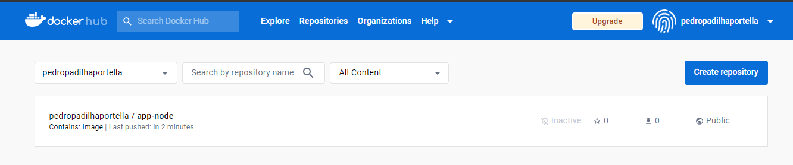

# :whale: Docker

Use como base a [documentacao do Docker](https://docs.docker.com/)

- [Comandos Importantes do Docker](#comandos-importantes-do-docker)
- [Como Gerar e Executar um Container com Base em um arquivo Dockerfile](#como-gerar-e-executar-um-container-com-base-em-um-arquivo-dockerfile)
- [Como Persistir dados no Host utilizando Bind Mounts](#como-persistir-dados-no-host-utilizando-bind-mounts)
- [Comunicação através da Rede](#comunicação-através-da-rede)
- [Exemplo Prático de Comunicação através da Rede](#exemplo-prático-de-comunicação-através-da-rede)
- [Exemplo Prático usando Docker Compose](#exemplo-prático-usando-docker-compose)

### Comandos Importantes do Docker

```bash
  # Listar containers em execucao
  docker ps
  # Listar containers
  docker ps -a
  # Listar containers mostrando o size
  docker ps -s
  # Listar containers em execucao (comando completo)
  docker container ls
  # Listar containers (comando completo)
  docker container ls -a

  # Iniciar um container
  docker run <container-name>
  # Parar um container
  docker stop <container-id>
  # Pausar um container
  docker pause <container-id>
  # Despausar um container
  docker unpause <container-id>
  # Remover um container
  docker rm <container-id>
  
  # Listar imagens
  docker images
  # Remover uma imagem
  docker image rm <image-id>

  # Parar todos os container (usando um comando encadeado para listar todos os containers)
  docker stop $(docker container ls -q)

  # Remover todos os container (usando um comando encadeado para listar todos os containers)
  docker container rm $(docker container ls -aq)

  # Remover todas as imagens (usando um comando encadeado para listar todas as imagens)
  docker rmi $(docker image ls -aq) --force
```

### Como Gerar e Executar um Container com Base em um arquivo Dockerfile

```bash
  # Gerar a imagem
  docker build -t pedropadilhaportella/app-node:1.0 .

  # Executar o container
  docker run -d -p 8080:3000 pedropadilhaportella/app-node:1.0

  # Executar o container sem o mapeamento de portas
  docker run -d pedropadilhaportella/app-node:1.0

  # Fazer login no docker
  docker login -u pedropadilhaportella

  # Subir uma imagem para o Docker Hub
  docker push pedropadilhaportella/app-node:1.0

  # Gerar uma cópia da imagem com outra tag/repositório
  docker tag pedropadilhaportella/app-node:1.0 aluradocker/app-node:1.0
```



### Como Persistir dados no Host utilizando Bind Mounts

Nos comandos a seguir, temos um exemplo de como usar Bind Mounts para persistir dados no Host
a partir de um diretório específico.

```bash
  # Executar um container referenciando uma pasta no host para persistir os dados
  docker run -it --mount type=bind,source=C:\docker-volumes,target=/app ubuntu bash 
  # Ou
  docker run -it -v C:\docker-volumes:/app ubuntu
```

Nos comandos a seguir, temos um exemplo de como usar Bind Mounts para persistir dados no Host
a partir de um volume.

```bash
  # Criar um volume
  docker volume create <volume-name>
  # Listar todos os volumes
  docker volume ls
  # Remover um volume
  docker volume rm <volume-name>
  # Remover todos os volumes que nao estao conectados a um container
  docker volume prune
  # Remover um container junto com seu volume
  docker rm -v <container-name>

  # Executar um container, referenciando um volume para a persistencia de dados
  # Se nao existir o volume referenciado, ele vai criar o volume com o nome definido no comando
  docker run -it --mount source=meu-volume,target=/app ubuntu bash
  # Ou
  docker run -it -v meu-volume:/app ubuntu bash
```

Nos comandos a seguir, temos um exemplo de como usar Bind Mounts para persistir dados no Host
a partir de tmpf, com dados em memória.

```bash
  # Executar um container, usando o tmpf para a persistencia de dados em memória
  docker run -it --tmpf=/app ubuntu bash
```

### Comunicação através da Rede

A rede de contêineres refere-se à capacidade dos contêineres se conectarem e 
se comunicarem entre si ou com cargas de trabalho não Docker.

```bash
  # Listar todas as redes que podem ser configuradas nos containers
  docker network ls

  # Remover uma rede
  docker network rm <network-name>
```

Considerando que dois Containers em execução utilizem a mesma Rede, a Bridge, 
se dentro de um container for executado um ping para o IP do outro, 
eles devem conseguir se comunicacar.

```bash
  # Execute dois containers em terminais diferentes
  docker run -it ubuntu bash

  # Encontre o IPAddress de um deles usando os comandos
  # Encontre o IPAddress de um deles usando os comandos "docker ps" para selecionar o Id de um deles
  # E depois "docker inspect <container-id>" para encontrar o IPAddress dele.

  # E no outro container, execute os seguintes comando para dar o ping no IPAddress do primeiro.
  $# apt-get update
  $# apt-get install iputils-ping
  $# ping 172.17.0.3
```

Como criar containers com nomes específicos e utilizando uma rede própria:

```bash
  # Crie uma rede, utilizando o driver da bridge como base
  docker network create --driver bridge alura-bridge

  # Crie seus containers e defina a rede que deseja usar
  docker run -it --name ubuntu1 --network alura-bridge ubuntu
  docker run -it --name ubuntu2 --network alura-bridge ubuntu

  # Depois é só realizar o ping de um container no IPAddress do outro
```

O driver de rede none define que o container nao terá nenhuma interface de rede,
logo não poderá se comunicar com outros containers e afins. 
Ao executar o inspect nesse container, nota-se que ele nao tem configurações de rede

```bash 
  docker run -d --name offline --network none ubuntu sleep 1d
  docker inspect offline
```

O driver de rede host define que o container utilará o mesmo driver que o host,
sem isolamento entre a interface do container e do host, no caso, a minha máquina.

```bash 
  docker run -d --name local --network host ubuntu sleep 1d
```

### Exemplo Prático de Comunicação através da Rede

Nesse exemplo, vamos conectar uma aplicação chamada AluraBooks ao MongoD pelo Docker usando containers e redes.
Primeiramente, vamos baixar as duas imagens nas vesões especificadas, depois vamos executar os dois containers, 
definindo a mesma rede, que pode ser criada pelo comando `docker network create --driver bridge alura-bridge`.
Para o container aluraBooks, vamos mapear a porta 3000. E assim podemos acessar em http://localhost:3000.

```bash 
  docker pull mongo:4.4.6
  docker pull aluradocker/alura-books:1.0

  docker run -d --network alura-bridge --name meu-mongo mongo:4.4.6
  docker run -d --network alura-bridge --name alurabooks -p 3000:3000 aluradocker/alura-books:1.0
```

### Exemplo Prático usando Docker Compose

Compose é uma ferramenta para definir e executar aplicativos Docker com vários contêineres. Com o Compose, você usa um arquivo YAML para configurar os serviços do seu aplicativo. Então, com um único comando, você cria e inicia todos os serviços da sua configuração.

Nesse exemplo, vamos refazer o exemplo anterior, porém registrando todo o passo a passo em um arquivo docker-compose que pode ser encontrado na raiz desse projeto.
E assim podemos acessar em http://localhost:3000.

```bash 
  # Subir os containers de acordo com o que foi configurado no docker compose
  docker compose up

  # Listar containers em execução pelo docker compose
  docker compose ps
  
  # Remover todos os containers, redes e demais configurados pelo docker compose
  docker compose down
```