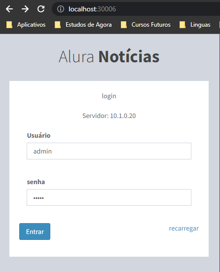
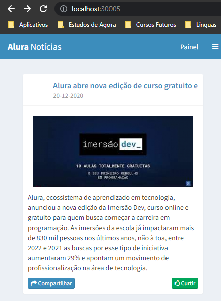
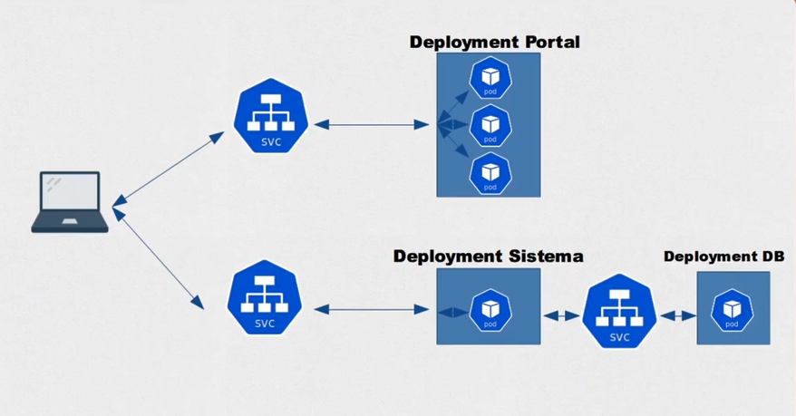

# :snowflake: Kubernetes

-   [Iniciando com Kubernetes](#iniciando-com-kubernetes)
-   [Entendendo os Pods](#entendendo-os-pods)
-   [Expondo Pods com Services](#expondo-pods-com-services)
    -   [ClusterIP](#clusterip)
    -   [NodePort](#nodeport)
    -   [LoadBalance](#loadbalance)
-   [Projeto Portal de Notícias](#projeto-portal-de-notícias)
    -   [ConfigMaps](#configmaps)
-   [ReplicaSets](#replicasets)
-   [Deployment](#deployment)
-   [Implementando Deployments no Projeto de Notícias](#implementando-deployments-no-projeto-de-notícias)
-   [Persistindo dados com Volumes](#persistindo-dados-com-volumes)
-   [Utilizando Storage Classes](#utilizando-storage-classes)
-   [Probes](#probes)
    -   [Liveness Probe](#liveness-probe)
    -   [Readiness Probe](#readiness-probe)
-   [HorizontalPodAutoscaler](#horizontalPodAutoscaler)

### Iniciando com Kubernetes

O pré requisito para iniciarmos com Kubernetes, é tem o Docker instalado na máquina, a partir disso, podemos habilitar o Kubernetes pela ferramenta do Docker Desktop na aba de Configurações.

O Kubernetes é uma engine de orquestração de contêineres Open Source utilizado para automatizar a implantação, dimensionamento e gerenciamento de aplicativos em contêiner.

Use como base a [documentacao do Kubernetes](https://kubernetes.io/pt-br/docs/home)

### Entendendo os Pods

Pods são os menores e mais básicos objetos implantáveis no Kubernetes. Um pod representa uma única instância de um processo em execução no seu cluster. Os pods contêm um ou mais contêineres, como os Docker.

```bash
  # Criando um Pod de forma imperativa
  kubectl run nginx-pod --image=nginx:latest

  # Listando os Pods em execução (com a flag --watch)
  kubectl get pods --watch
  # Ou
  kubectl get pods -o wide

  # Descrevendo informações de um Pod
  kubectl describe pod nginx-pod

  # Editar informações de um Pod
  kubectl edit pod nginx-pod

  # Deletar um Pod
  kubectl delete pod nginx-pod
```

Podemos trabalhar com o Kubernetes pelo terminal de maneira imperativa, digitando todos os comando que desejamos realizar em nosso Pod, um por um. Ou podemos trabalhar com o Kubernetes de forma declarativa, criando arquivos yaml que vão conter todas as configurações dos Pods, Services e afins.

Vamos criar um exemplo chamado primeiro-pod.yaml, e nele vamos adicionar as mesmas instruções que fizemos pelo terminal, de forma imperativa.

```yaml
apiVersion: v1
kind: Pod
metadata:
  name: primeiro-pod
spec:
  containers:
    - name: nginx-container
      image: nginx:latest
```

E em seguida aplicar a criação do Pod com o comando `kubectl apply -f primeiro-pod.yaml`:

```bash
  # Criar o pod com base em um arquivo yaml
  kubectl apply -f primeiro-pod.yaml

  # Executar um bash dentro do Pod
  kubectl exec -it primeiro-pod -- bash

  # Deletar o pod que referencia o arquivo yaml
  kubectl delete -f primeiro-pod.yaml
```

### Expondo Pods com Services

Os serviços de Kubernetes conectam um conjunto de pods a um nome de serviço e endereço IP abstraídos. Os serviços fornecem detecção e roteamento entre pods. Por exemplo, os serviços conectam o front-end de um aplicativo ao seu back-end, cada um deles em execução em implantações separadas em um cluster.

#### ClusterIP

Para esse exemplo, vamos criar 2 Pods, o pod-1 e o pod-2. Em seguida, vamos criar um Service, do tipo `ClusterIP`, que expõe o Pod-2 para poder ser acessado pelo Pod-1, pelo IP do Service, na porta exposta.

Um serviço do tipo `ClusterIP` serve para fazer a comunicação entre diferentes pods dentro de um mesmo cluster.

##### pod-1.yaml
```yaml
apiVersion: v1
kind: Pod
metadata:
  name: pod-1
  labels:
    app: primeiro-pod
spec:
  containers:
    - name: container-pod-1
      image: nginx:latest
      ports:
        - containerPort: 80
```

##### pod-2.yaml
```yaml
apiVersion: v1
kind: Pod
metadata:
  name: pod-2
  labels:
    app: segundo-pod
spec:
  containers:
    - name: container-pod-2
      image: nginx:latest
      ports:
        - containerPort: 80
```

##### svc-pod-2.yaml
```yaml
apiVersion: v1
kind: Service
metadata:
  name: svc-pod-2
spec:
  type: ClusterIP
  selector:
    app: segundo-pod
  ports:
    - port: 80
      targetPort: 80
```

E vamos criar esses Pods e o Service:

```bash
  # Criar os pods e o service
  kubectl apply -f pod-1.yaml
  kubectl apply -f pod-2.yaml
  kubectl apply -f svc-pod-2.yaml
```

Em seguida, vamos tentar dar um curl a partir do Pod-1 no IP do Service, na porta :80 para tentar acessar o Pod-2.

```bash
  # Listar os Services para pegar o IP do Svc-Pod-2
  kubectl get svc

  # Executar o pod-1 em modo interativo e dar um curl no IP do ClusterIP
  kubectl exec -it pod-1 -- bash
  :/# curl 10.111.0.216:80
```

Se deletarmos o Pod-2 e tentarmos fazer o curl novamente, teremos um erro, porque o pod foi deletado, embora o service ainda esteja rodando:

> $ curl: Failed to connect to 10.111.0.216 port 80: Connection refused

#### NodePort

Agora vamos criar um outro tipo de Service chamado `NodePort`, que nada mais é do que um tipo de serviço que permitem a comunicação com o mundo externo. Em seguida, executar `kubectl apply -f svc-pod-1.yaml` para criá-lo.

##### svc-pod-1.yaml
```yaml
apiVersion: v1
kind: Service
metadata:
  name: svc-pod-1
spec:
  type: NodePort
  selector:
    app: primeiro-pod
  ports:
    - port: 80
      targetPort: 80
      nodePort: 30003
```

Podemos acessar da mesma forma que o ClusterIP, por meio do IP da NodePort svc-pod-1, na porta 80.
E podemos acessar externamente pela url http://localhost:30003, que é a mesma porta configurada no NodePort.

```bash
  # Listar os Services para pegar o IP do Svc-Pod-1
  kubectl get svc

  # Executar o pod-1 em modo interativo e dar um curl no IP do NodePort
  kubectl exec -it pod-1 -- bash
  :/# curl 10.108.235.139:80
```

#### LoadBalance

Um LoadBalancer nada mais é do que um Service que permite a comunicação entre uma máquina do mundo externo e os nosso pods. Só que ele automaticamente se integra ao LoadBalancer do nosso cloud provider. Então quando nós criamos um LoadBalancer ele vai utilizar automaticamente, sem nenhum esforço manual, o cloud provider da AWS ou do Google Cloud Platform ou da Azure, e assim por diante. Portanto, um Load Balancer é um NodePort e ClusterIP ao mesmo tempo.

##### svc-pod-1-load-balancer.yaml
```yaml
apiVersion: v1
kind: Service
metadata:
  name: svc-pod-1-load-balancer
  labels:
    app: portal-noticias
spec:
  type: LoadBalancer
  selector:
      app: primeiro-pod
  ports:
    - containerPort: 80
      nodePort: 30004
```

### Projeto Portal de Notícias


Primeramente, vamos configurar o Portal de Notícias.

Crie um Pod chamado `portal-noticias` que contenha a imagem `aluracursos/portal-noticias:1` e esteja exposto na porta 80, e uma NodePort chamado `svc-portal-noticias`, fazendo o mapeamento para a porta 80/3005. Ao final, você deve conseguir acessar a aplicação em http://localhost:30005.

```bash
  kubectl apply -f noticias/portal-noticias.yaml
  kubectl apply -f noticias/svc-portal-noticias.yaml
```

Em seguida, vamos configurar o Sistema de Cadastro de Notícias.

Crie mais um Pod chamado `sistema-noticias` que contenha a imagem `aluracursos/sistema-noticias:1` e esteja exposto na porta 80, e uma NodePort chamado `svc-sistema-noticias`, fazendo o mapeamento para a porta 80/3006. Ao final, você deve conseguir acessar a aplicação em http://localhost:30006.

```bash
  kubectl apply -f noticias/sistema-noticias.yaml
  kubectl apply -f noticias/svc-sistema-noticias.yaml
```

Agora vamos configurar o Banco de dados que vai armazernar nossas noticias.

Crie outro Pod chamado `db-noticias` que contenha a imagem `aluracursos/mysql-db:1` e esteja exposto na porta 3306, e como não vamos acessar esse serviço de fora do Cluster, podemos usar um ClusterIP chamado `svc-db-noticias`, também na porta 3306.

E para o `db-noticias` especificamente, precisamos configurar algumas variáveis de ambiente relacionadas ao acesso ao banco de dados:

```yaml
spec:
  containers:
    env:
      - name: "MYSQL_ROOT_PASSWORD"
        value: "q1w2e3r4"
      - name: "MYSQL_DATABASE"
        value: "empresa"
      - name: "MYSQL_PASSWORD"
        value: "q1w2e3r4"
```

```bash
  kubectl apply -f noticias/db-noticias.yaml
  kubectl apply -f noticias/svc-db-noticias.yaml
```

Podemos checar se o banco está rodando corretamente acessando ele via terminal, fazendo login no mysql e rodando alguns comando sql pra ver as tabelas e seus dados.

```bash
  kubectl exec -it db-noticias -- bash

  :/# mysql -u root -p
  Enter password: 

  mysql> show databases;
  mysql> use empresa;
  mysql> show tables;
  mysql> select * from usuario;
```

Porém não fica muito correto manter essas variáveis de ambiente acopladas no Pod, então como nós poderíamos separar isso para que apenas a parte de configuração fique no Pod, para deicá-lo o máximo de portável possível, não atrelando ele à nenhuma configuração específica.

#### ConfigMaps

A solução é utilizar ConfigMaps. Ele vai ser responsável por armazenar essas configurações que nós precisamos utilizar dentro de determinados pods, para não acoplarmos o nosso recurso com informações de configuração.

Então vamos remover a seção de `env` do `db-noticias` e criar um `ConfigMap` para isso.

##### db-configmap.yaml
```yaml
apiVersion: v1
kind: ConfigMap
metadata:
  name: db-configmap
data:
  MYSQL_ROOT_PASSWORD: q1w2e3r4
  MYSQL_DATABASE: empresa
  MYSQL_PASSWORD: q1w2e3r4
```

```bash
  kubectl apply -f noticias/db-configmap.yaml

  # Listar ConfigMaps
  kubectl get configmaps

  # Mostrar a descrição do ConfigMap
  kubectl describe configmap db-configmap
```

E vamos referencias o `env` do `db-noticias` para usar o `ConfigMap` que criamos, remover o Pod antigo, para resetar o banco de dados com `kubectl delete pod db-noticias` e aplicar as alterações com `kubectl apply -f noticias/db-noticias.yaml`

##### db-noticias.yaml
```yaml
apiVersion: v1
kind: Pod
metadata:
  name: db-noticias
  labels:
    app: db-noticias
spec:
  containers:
  - name: db-noticias-container
    image: aluracursos/mysql-db:1
    ports:
      - containerPort: 3306
    envFrom:
      - configMapRef:
          name: db-configmap
```

O Pod de Sitema também precisa de algumas variáveis de ambiente para configurar o acesso ao banco de dados do lado do servidor, então criaremos um `ConfigMap` chamado `sistema-configmap.yaml`, com as seguintes variáveis, e sem seguida, referenciar esse ConfigMap no `env` do `sistema-noticias.yaml`, assim como fizemos no `db-noticias.yaml`.

##### sistema-configmap.yaml
```yaml
apiVersion: v1
kind: ConfigMap
metadata:
  name: sistema-configmap
data:
  HOST_DB: svc-db-noticias:3306
  USER_DB: root
  PASS_DB: q1w2e3r4
  DATABASE_DB: empresa
```

E assim podemos acessar o Sistema de Cadastro de Notícias em `http://localhost:30006/`, fazer login com usuário e senha admin e cadastrar notícias.



Agora precisamos configurar os Pods do Portal de Notícias para poder acessar o Sistema de Notícias para apresentar as notícias cadastradas, para isso, precisamos configurar uma variável de ambiente do IP do Sistema, então novamente vamos criar um ConfigMap para isso e aplicar com o comando `kubectl apply -f noticias/portal-configmap.yaml` e referenciar esse ConfigMap no `env` do `portal-noticias.yaml`, depois deletar o Pod `portal-noticias` e recriar com o comando `kubectl apply -f noticias/portal-noticias.yaml`.

##### portal-configmap.yaml
```yaml
apiVersion: v1
kind: ConfigMap
metadata:
  name: portal-configmap
data:
  IP_SISTEMA: http://localhost:30006
```
E assim podemos acessar o Portal Notícias em `http://localhost:30005/`, e ver as notícias criadas no portal.



### ReplicaSets

Então vamos supor que por algum motivo o Pod `portal-noticias` caia, ou seja deletado com o comando `kubectl delete pod portal-noticias` sem querer, como poderemos garantir que sempre hajam rélicas dele rodando para direcionar o tráfego, e ter um Serviço que possa restaurar esse Pod automaticamente?

Podemos usar um `ReplicaSet`, que nada mais é que um processo que executa várias instâncias de um pod e mantém o número especificado de pods constante. Ele garante que um conjunto estável de pods réplica esteja em execução a qualquer momento, o que garante um número especificado disponível de pods idênticos.

##### portal-noticias-replicaset.yaml
```yaml
apiVersion: apps/v1
kind: ReplicaSet
metadata:
  name: portal-noticias-replicaset
spec:
  template:
    metadata:
      name: portal-noticias
      labels:
        app: portal-noticias
    spec:
      containers:
      - name: portal-noticias-container
        image: aluracursos/portal-noticias:1
        ports:
          - containerPort: 80
        envFrom:
          - configMapRef:
              name: portal-configmap
  replicas: 3
  selector:
    matchLabels:
      app: portal-noticias
```
Então criando um ReplicaSet e executando `kubectl apply -f noticias/portal-noticias-replicaset.yaml`, agora teremos uma quantidade definida de Pods identicos, e se algum deles falhar, o ReplicaSet automaticamente vai tentar criar um novo, enquanto os outros Replicas recebem as requisições, além de que podemos configurar um `Balanceamento de Carga` entre esses Pods.

```bash
  # Listando todos os Pods, onde poderemos ver que temos 3 Pods do portal-noticias
  kubectl get pods

  # Listando todos os ReplicaSets, onde poderemos ver o ReplicaSets que criamos
  kubectl get rs 

  # Ao deletar um dos Pods do ReplicaSet, autpmaticamente será criado uma nova replica
  kubectl delete pod portal-noticias-replicaset-fbtlj

NAME                               READY   STATUS    RESTARTS      AGE
portal-noticias-replicaset-4ck4r   1/1     Running   0             37m
portal-noticias-replicaset-phbkt   1/1     Running   0             37m
portal-noticias-replicaset-zg5wc   1/1     Running   0             46s
db-noticias                        1/1     Running   0             44h
sistema-noticias                   1/1     Running   0             44h
```

### Deployment

Deployment nada mais é do que uma camada acima de um ReplicaSet. Então, quando nós definimos um Deployment,
Então vamos criar um Deployment como no exemplo a seguir e executar com o comando `kubectl apply -f noticias/nginx-deployment.yaml`

##### nginx-deployment.yaml
```yaml
apiVersion: apps/v1
kind: Deployment
metadata:
  name: nginx-deployment
spec:
  replicas: 3
  template:
    metadata:
      name: nginx-pod
      labels:
        app: nginx-pod
    spec:
      containers:
      - name: nginx-container
        image: nginx:stable
        ports:
          - containerPort: 80
  selector:
    matchLabels:
      app: nginx-pod
```

Dessa forma, se listarmos os Pods, veremos que agora tem mais 3 Pods chamados nginx-deployment, também teremos dois ReplicaSet e um unico Deployment.

```bash
  # Listando todos os Pods, onde poderemos ver que temos 3 Pods novos nginx-deployment
  kubectl get pods

  # Listando todos os ReplicaSets, onde poderemos ver os dois ReplicaSets que criamos
  kubectl get rs 

  # Listando todos os Deployments
  kubectl get deployments

REVISION  CHANGE-CAUSE
4         Definindo a imagem do nginx com latest
5         kubectl.exe apply --filename=noticias/nginx-deployment.yaml --record=true
```

A vantagem é que usando Deployments, podemos ter um controle de revisões dos nossos Pods, por exemplo, com o comando `kubectl rollout history deployment nginx-deployment`, então, se executarmos qualquer alteração em nosso Deployment e aplicarmos as alterações com a flag `--record`, e então buscarmos o rollout history, teremos as versões salvas do Deployment, inclusive podemos configurar a changeCause, a partir do comando:

`kubectl annotate deployment nginx-deployment kubernetes.io/change-cause="Definindo a imagem do nginx com latest"`

Assim como também podemos voltar para alguma revisão específica, com o comando `kubectl rollout undo deployment nginx-deployment --to-revision=1`, onde os Pods serão deletado, e novos Pods com a revisão especificada serão gerados.

### Implementando Deployments no Projeto de Notícias

Então para melhorar o projeto, vamos implementar Deployments e ReplicaSets nos Pods do nosso sistema, para garantir o máximo de Disponibilidade dos recursos em nossa Aplicação.



Primeiro, vamos limpar os Deployment, ReplicaSets e Pods criados anteriormente, vamos remover o ReplicaSet criado anteriormente, depois vamos criar um arquivo para o Deployment do Portal de Noticias e executar com `kubectl apply -f noticias/portal-noticias-deployment.yaml`.

##### portal-noticias-deployment.yaml
```yaml
apiVersion: apps/v1
kind: Deployment
metadata:
  name: portal-noticias-deployment
spec:
  template:
    metadata:
      name: portal-noticias
      labels:
        app: portal-noticias
    spec:
      containers:
      - name: portal-noticias-container
        image: aluracursos/portal-noticias:1
        ports:
          - containerPort: 80
        envFrom:
          - configMapRef:
              name: portal-configmap
  replicas: 3
  selector:
    matchLabels:
      app: portal-noticias
```

```bash
  # Gerando uma anotação para essa versao do Deployment
  kubectl annotate deployment portal-noticias-deployment kubernnetes.io/change-cause="Criando o Deployment do Portal de Noticias v1.0"

  # Listando histórico de Deployments
  kubectl rollout history deployment portal-noticias-deployment
  
REVISION  CHANGE-CAUSE
1         Criando o Deployment do Portal de Noticias v1.0
```

E agora faremos o Deployment do nosso Sistema de Noticias:

##### sistema-noticias-deployment.yaml
```yaml
apiVersion: apps/v1
kind: Deployment
metadata:
  name: sistema-noticias-deployment
spec:
  template:
    metadata:
      name: sistema-noticias
      labels:
        app: sistema-noticias
    spec:
      containers:
      - name: sistema-noticias-container
        image: aluracursos/sistema-noticias:1
        ports:
          - containerPort: 80
        envFrom:
          - configMapRef:
              name: sistema-configmap
  replicas: 1
  selector:
    matchLabels:
      app: sistema-noticias
```

```bash
  # Deletando o Pod antigo
  kubectl delete pod sistema-noticias

  # Criando o Deployment
  kubectl apply -f noticias/sistema-noticias-deployment.yaml

  # Configurando a changeCause da versão
  kubectl annotate deployment sistema-noticias-deployment kubernetes.io/change-cause="Criando o Deployment do Sistema de Noticias v1.0"

  kubectl rollout history deployment sistema-noticias-deployment
```

E por fim o Deployment do nosso banco de dados:

##### db-noticias-deployment.yaml
```yaml
apiVersion: apps/v1
kind: Deployment
metadata:
  name: db-noticias-deployment
spec:
  template:
    metadata:
      name: db-noticias
      labels:
        app: db-noticias
    spec:
       containers:
        - name: db-noticias-container
          image: aluracursos/mysql-db:1
          ports:
            - containerPort: 3306
          envFrom:
            - configMapRef:
                name: db-configmap
  replicas: 1
  selector:
    matchLabels:
      app: db-noticias
```

```bash
  # Deletando o Pod antigo
  kubectl delete pod db-noticias

  # Criando o Deployment
  kubectl apply -f noticias/db-noticias-deployment.yaml

  # Configurando a changeCause da versão
  kubectl annotate deployment db-noticias-deployment kubernetes.io/change-cause="Criando o Deployment do Banco de Dados MySql v1.0"

  kubectl rollout history deployment db-noticias-deployment
```

### Persistindo dados com Volumes

Semelhante aos Volumes do Docker, os volumes do Kubernetes possuem ciclos de vida independente dos containers, porém são dependentes dos Pods. Ou seja, podemos configurar Volumes dentro dos Pods, para que todos os dados sejam armazenados nele.

O Kubernetes suporta muitos tipos de volumes. Um Pod é capaz de utilizar qualquer quantidade de tipos de volumes simultaneamente. Os tipos de volume efêmeros têm a mesma vida útil do pod, mas os volumes persistentes existem além da vida útil de um pod. Quando um pod deixa de existir, o Kubernetes destrói volumes efêmeros; no entanto, o Kubernetes não destrói volumes persistentes. Para qualquer tipo de volume em um determinado pod, os dados são preservados entre as reinicializações do contêiner.

Dentre os tipos de Volumes, temos o `PersistentVolume` (PV), que é um tipo de Volume de dados Persistente, ou seja, é um recurso dentro do cluster independente que tem um ciclo de vida independente de qualquer Pod. Além de poder ter uma capacidade de armazenamento estática ou dinâmica.

Se um volume persistente (PV) é o volume "físico" na máquina host que armazena seus dados persistentes. Uma reivindicação de volume persistente (PVC) é uma solicitação para que a plataforma crie um PV para você e você anexe PVs aos seus Pods por meio de um PVC. `Pod -> PVC -> PV -> Host machine`

### Utilizando Storage Classes

Um `StorageClass` fornece uma maneira para descrever as "classes" de armazenamento que oferecem. Classes diferentes podem ser mapeadas para níveis de qualidade de serviço, ou para políticas de backup, ou para políticas arbitrárias determinadas pelos administradores de cluster

### Utilizando StatefulSet

O `StatefulSet` funciona de maneira similar a um Deployment, mas ele é voltado para aplicações que devem manter o seu estado, isso significa que quando um Pod reinicia ou falha por algum motivo dentro de um Stateful Set e volta a execução, os arquivos serão mantidos.

Quando nós criarmos um Pod dentro de um StatefulSet, temos que definir que ele vai ter um Persistent Volume Claim para acessar um Persistent Volume. Sua configuração é bem semelhante ao Deplyment, mas precisa ter um PersistentVolumeClaim, não vamos precisar criar nem o PersistentVolume nem o StorageClass, porque o StatefulSet vai criar automaticamente, sob demanda.

```bash
  # Criando o StatefulSet
  kubectl apply -f noticias/sistema-noticias-statefulset.yaml

  # Criando um PersistentVolumeClaim para salvar as imagens
  kubectl apply -f noticias/imagens-pvc.yaml

  # Criando um PersistentVolumeClaim para salvar as sessão do usuário
  kubectl apply -f noticias/sessao-pvc.yaml
```

### Probes

Probes são sondagens de atividade que servem para saber se a aplicação está saudável, detectar um problemas, erros, deadlocks, e saber se deve reiniciar o Pod ou não.

#### Liveness Probe

Configurando um Liveness Probe (Prova de Vida) dos Pods, para que seja feita uma requisição em na aplicação a cada 10 segundos, aceitando até 3 falhas, com um delay inicial de 20 segundos.

```yaml
  livenessProbe:
    httpGet:
      path: /
      port: 80
    periodSeconds: 10
    failureThreshold: 3
    initialDelaySeconds: 20
```

#### Readness Probe

Configurando um Readiness Probe dos Pods, para que sejam feitas requisições na aplicação a cada 10 segundos, para checar se o Pod já está ativo e operante para receber requisições.

```yaml
  readinessProbe:
    httpGet:
      path: /inserir_noticias.php
      port: 80
    periodSeconds: 10
    failureThreshold: 5
    initialDelaySeconds: 3
```

### HorizontalPodAutoscaler

No Kubernetes, um HorizontalPodAutoscaler tem a capacidade de atualizar automaticamente um recurso de workload (como um StatefulSet), com o objetivo de dimensionar automaticamente a carga de trabalho para atender à demanda.

Se por algum motivo, houve um aumento de carga nos Pods devido a um aumento de requisções, o HorizontalPodAutoscaler vai automaticamente implantar mais Pods para suprir a demanda.

Isso é diferente do escalonamento vertical , que para Kubernetes significaria atribuir mais recursos (por exemplo: memória ou CPU) aos pods que já estão em execução para a carga de trabalho.

Se a carga diminuir e o número de pods estiver acima do mínimo configurado, o HorizontalPodAutoscaler instrui o recurso de carga de trabalho (Deployment, StatefulSet ou outro recurso semelhante) a reduzir a escala verticalmente.

A atuação do HorizontalPodAutoscaler se baseia em métricas como utilização média de CPU, utilização média de memória ou qualquer outra métrica personalizada.

##### portal-noticias-hpa.yaml
```yaml
apiVersion: autoscaling/v2
kind: HorizontalPodAutoscaler
metadata:
  name: portal-noticias-hpa
spec:
  scaleTargetRef:
    apiVersion: apps/v1
    kind: Deployment
    name: portal-noticias-deployment
  minReplicas: 1
  maxReplicas: 10
  metrics:
  - type: Resource
    resource:
      name: cpu
      target:
        type: Utilization
        averageUtilization: 50
```

Vamos criar um HPA e depois checar se está rodando. Também vamos precisar configurar o campo de resources no nosso Deployment.

```bash
  # Criando um HorizontalPodAutoscaler
  kubectl apply -f noticias/portal-noticias-hpa.yaml

  # Listando os HPAs em execução
  kubectl get hpa
```