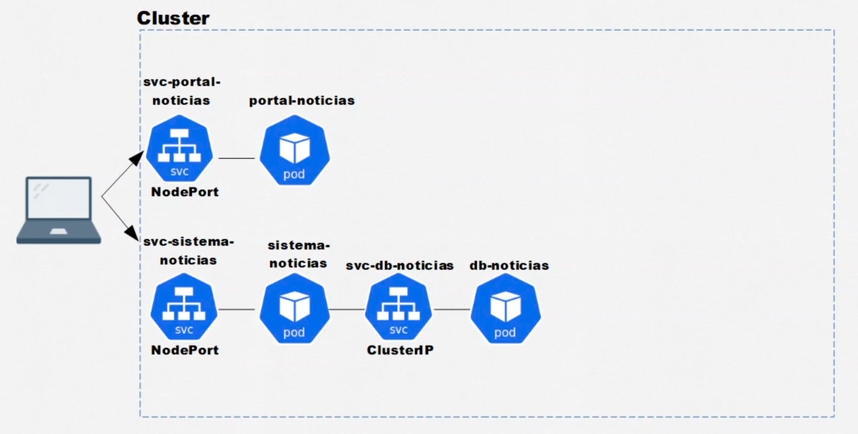
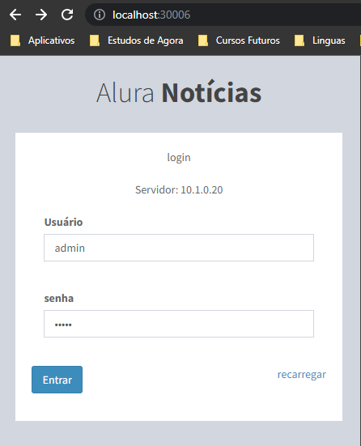
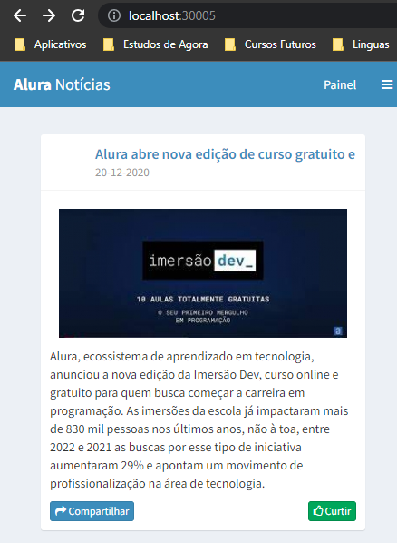

# :snowflake: Kubernetes: Pods, Services e ConfigMaps

-   [Iniciando com Kubernetes](#iniciando-com-kubernetes)
-   [Entendendo os Pods](#entendendo-os-pods)
-   [Expondo Pods com Services](#expondo-pods-com-services)
    -   [ClusterIP](#clusterip)
    -   [NodePort](#nodeport)
    -   [LoadBalance](#loadbalance)
-   [Projeto Portal de Notícias](#projeto-portal-de-notícias)
    -   [ConfigMaps](#configmaps)

### Iniciando com Kubernetes

O pré requisito para iniciarmos com Kubernetes, é tem o Docker instalado na máquina, a partir disso, podemos habilitar o Kubernetes pela ferramenta do Docker Desktop na aba de Configurações.

O Kubernetes é uma engine de orquestração de contêineres Open Source utilizado para automatizar a implantação, dimensionamento e gerenciamento de aplicativos em contêiner.

Use como base a [documentacao do Kubernetes](https://kubernetes.io/pt-br/docs/home)

### Entendendo os Pods

Pods são os menores e mais básicos objetos implantáveis no Kubernetes. Um pod representa uma única instância de um processo em execução no seu cluster. Os pods contêm um ou mais contêineres, como os Docker.

```bash
  # Criando um Pod de forma imperativa
  kubectl run nginx-pod --image=nginx:latest

  # Listando os Pods em execução (com a flag --watch)
  kubectl get pods --watch
  # Ou
  kubectl get pods -o wide

  # Descrevendo informações de um Pod
  kubectl describe pod nginx-pod

  # Editar informações de um Pod
  kubectl edit pod nginx-pod

  # Deletar um Pod
  kubectl delete pod nginx-pod
```

Podemos trabalhar com o Kubernetes pelo terminal de maneira imperativa, digitando todos os comando que desejamos realizar em nosso Pod, um por um. Ou podemos trabalhar com o Kubernetes de forma declarativa, criando arquivos yaml que vão conter todas as configurações dos Pods, Services e afins.

Vamos criar um exemplo chamado primeiro-pod.yaml, e nele vamos adicionar as mesmas instruções que fizemos pelo terminal, de forma imperativa.

```yaml
apiVersion: v1
kind: Pod
metadata:
  name: primeiro-pod
spec:
  containers:
    - name: nginx-container
      image: nginx:latest
```

E em seguida aplicar a criação do Pod com o comando `kubectl apply -f primeiro-pod.yaml`:

```bash
  # Criar o pod com base em um arquivo yaml
  kubectl apply -f primeiro-pod.yaml

  # Executar um bash dentro do Pod
  kubectl exec -it primeiro-pod -- bash

  # Deletar o pod que referencia o arquivo yaml
  kubectl delete -f primeiro-pod.yaml
```

### Expondo Pods com Services

Os serviços de Kubernetes conectam um conjunto de pods a um nome de serviço e endereço IP abstraídos. Os serviços fornecem detecção e roteamento entre pods. Por exemplo, os serviços conectam o front-end de um aplicativo ao seu back-end, cada um deles em execução em implantações separadas em um cluster.

#### ClusterIP

Para esse exemplo, vamos criar 2 Pods, o pod-1 e o pod-2. Em seguida, vamos criar um Service, do tipo `ClusterIP`, que expõe o Pod-2 para poder ser acessado pelo Pod-1, pelo IP do Service, na porta exposta.

Um serviço do tipo `ClusterIP` serve para fazer a comunicação entre diferentes pods dentro de um mesmo cluster.

##### pod-1.yaml
```yaml
apiVersion: v1
kind: Pod
metadata:
  name: pod-1
  labels:
    app: primeiro-pod
spec:
  containers:
    - name: container-pod-1
      image: nginx:latest
      ports:
        - containerPort: 80
```

##### pod-2.yaml
```yaml
apiVersion: v1
kind: Pod
metadata:
  name: pod-2
  labels:
    app: segundo-pod
spec:
  containers:
    - name: container-pod-2
      image: nginx:latest
      ports:
        - containerPort: 80
```

##### svc-pod-2.yaml
```yaml
apiVersion: v1
kind: Service
metadata:
  name: svc-pod-2
spec:
  type: ClusterIP
  selector:
    app: segundo-pod
  ports:
    - port: 80
      targetPort: 80
```

E vamos criar esses Pods e o Service:

```bash
  # Criar os pods e o service
  kubectl apply -f pod-1.yaml
  kubectl apply -f pod-2.yaml
  kubectl apply -f svc-pod-2.yaml
```

Em seguida, vamos tentar dar um curl a partir do Pod-1 no IP do Service, na porta :80 para tentar acessar o Pod-2.

```bash
  # Listar os Services para pegar o IP do Svc-Pod-2
  kubectl get svc

  # Executar o pod-1 em modo interativo e dar um curl no IP do ClusterIP
  kubectl exec -it pod-1 -- bash
  :/# curl 10.111.0.216:80
```

Se deletarmos o Pod-2 e tentarmos fazer o curl novamente, teremos um erro, porque o pod foi deletado, embora o service ainda esteja rodando:

> $ curl: Failed to connect to 10.111.0.216 port 80: Connection refused

#### NodePort

Agora vamos criar um outro tipo de Service chamado `NodePort`, que nada mais é do que um tipo de serviço que permitem a comunicação com o mundo externo. Em seguida, executar `kubectl apply -f svc-pod-1.yaml` para criá-lo.

##### svc-pod-1.yaml
```yaml
apiVersion: v1
kind: Service
metadata:
  name: svc-pod-1
spec:
  type: NodePort
  selector:
    app: primeiro-pod
  ports:
    - port: 80
      targetPort: 80
      nodePort: 30003
```

Podemos acessar da mesma forma que o ClusterIP, por meio do IP da NodePort svc-pod-1, na porta 80.
E podemos acessar externamente pela url http://localhost:30003, que é a mesma porta configurada no NodePort.

```bash
  # Listar os Services para pegar o IP do Svc-Pod-1
  kubectl get svc

  # Executar o pod-1 em modo interativo e dar um curl no IP do NodePort
  kubectl exec -it pod-1 -- bash
  :/# curl 10.108.235.139:80
```

#### LoadBalance

Um LoadBalancer nada mais é do que um Service que permite a comunicação entre uma máquina do mundo externo e os nosso pods. Só que ele automaticamente se integra ao LoadBalancer do nosso cloud provider. Então quando nós criamos um LoadBalancer ele vai utilizar automaticamente, sem nenhum esforço manual, o cloud provider da AWS ou do Google Cloud Platform ou da Azure, e assim por diante. Portanto, um Load Balancer é um NodePort e ClusterIP ao mesmo tempo.

##### svc-pod-1-load-balancer.yaml
```yaml
apiVersion: v1
kind: Service
metadata:
  name: svc-pod-1-load-balancer
  labels:
    app: portal-noticias
spec:
  type: LoadBalancer
  selector:
      app: primeiro-pod
  ports:
    - containerPort: 80
      nodePort: 30004
```

### Projeto Portal de Notícias



Primeramente, vamos configurar o Portal de Notícias.

Crie um Pod chamado `portal-noticias` que contenha a imagem `aluracursos/portal-noticias:1` e esteja exposto na porta 80, e uma NodePort chamado `svc-portal-noticias`, fazendo o mapeamento para a porta 80/3005. Ao final, você deve conseguir acessar a aplicação em http://localhost:30005.

```bash
  kubectl apply -f noticias/portal-noticias.yaml
  kubectl apply -f noticias/svc-portal-noticias.yaml
```

Em seguida, vamos configurar o Sistema de Cadastro de Notícias.

Crie mais um Pod chamado `sistema-noticias` que contenha a imagem `aluracursos/sistema-noticias:1` e esteja exposto na porta 80, e uma NodePort chamado `svc-sistema-noticias`, fazendo o mapeamento para a porta 80/3006. Ao final, você deve conseguir acessar a aplicação em http://localhost:30006.

```bash
  kubectl apply -f noticias/sistema-noticias.yaml
  kubectl apply -f noticias/svc-sistema-noticias.yaml
```

Agora vamos configurar o Banco de dados que vai armazernar nossas noticias.

Crie outro Pod chamado `db-noticias` que contenha a imagem `aluracursos/mysql-db:1` e esteja exposto na porta 3306, e como não vamos acessar esse serviço de fora do Cluster, podemos usar um ClusterIP chamado `svc-db-noticias`, também na porta 3306.

E para o `db-noticias` especificamente, precisamos configurar algumas variáveis de ambiente relacionadas ao acesso ao banco de dados:

```yaml
spec:
  containers:
    env:
      - name: "MYSQL_ROOT_PASSWORD"
        value: "q1w2e3r4"
      - name: "MYSQL_DATABASE"
        value: "empresa"
      - name: "MYSQL_PASSWORD"
        value: "q1w2e3r4"
```

```bash
  kubectl apply -f noticias/db-noticias.yaml
  kubectl apply -f noticias/svc-db-noticias.yaml
```

Podemos checar se o banco está rodando corretamente acessando ele via terminal, fazendo login no mysql e rodando alguns comando sql pra ver as tabelas e seus dados.

```bash
  kubectl exec -it db-noticias -- bash

  :/# mysql -u root -p
  Enter password: 

  mysql> show databases;
  mysql> use empresa;
  mysql> show tables;
  mysql> select * from usuario;
```

Porém não fica muito correto manter essas variáveis de ambiente acopladas no Pod, então como nós poderíamos separar isso para que apenas a parte de configuração fique no Pod, para deicá-lo o máximo de portável possível, não atrelando ele à nenhuma configuração específica.

#### ConfigMaps

A solução é utilizar ConfigMaps. Ele vai ser responsável por armazenar essas configurações que nós precisamos utilizar dentro de determinados pods, para não acoplarmos o nosso recurso com informações de configuração.

Então vamos remover a seção de `env` do `db-noticias` e criar um `ConfigMap` para isso.

##### db-configmap.yaml
```yaml
apiVersion: v1
kind: ConfigMap
metadata:
  name: db-configmap
data:
  MYSQL_ROOT_PASSWORD: q1w2e3r4
  MYSQL_DATABASE: empresa
  MYSQL_PASSWORD: q1w2e3r4
```

```bash
  kubectl apply -f noticias/db-configmap.yaml

  # Listar ConfigMaps
  kubectl get configmaps

  # Mostrar a descrição do ConfigMap
  kubectl describe configmap db-configmap
```

E vamos referencias o `env` do `db-noticias` para usar o `ConfigMap` que criamos, remover o Pod antigo, para resetar o banco de dados com `kubectl delete pod db-noticias` e aplicar as alterações com `kubectl apply -f noticias/db-noticias.yaml`

##### db-noticias.yaml
```yaml
apiVersion: v1
kind: Pod
metadata:
  name: db-noticias
  labels:
    app: db-noticias
spec:
  containers:
  - name: db-noticias-container
    image: aluracursos/mysql-db:1
    ports:
      - containerPort: 3306
    envFrom:
      - configMapRef:
          name: db-configmap
```

O Pod de Sitema também precisa de algumas variáveis de ambiente para configurar o acesso ao banco de dados do lado do servidor, então criaremos um `ConfigMap` chamado `sistema-configmap.yaml`, com as seguintes variáveis, e sem seguida, referenciar esse ConfigMap no `env` do `sistema-noticias.yaml`, assim como fizemos no `db-noticias.yaml`.

##### sistema-configmap.yaml
```yaml
apiVersion: v1
kind: ConfigMap
metadata:
  name: sistema-configmap
data:
  HOST_DB: svc-db-noticias:3306
  USER_DB: root
  PASS_DB: q1w2e3r4
  DATABASE_DB: empresa
```

E assim podemos acessar o Sistema de Cadastro de Notícias em `http://localhost:30006/`, fazer login com usuário e senha admin e cadastrar notícias.



Agora precisamos configurar os Pods do Portal de Notícias para poder acessar o Sistema de Notícias para apresentar as notícias cadastradas, para isso, precisamos configurar uma variável de ambiente do IP do Sistema, então novamente vamos criar um ConfigMap para isso e aplicar com o comando `kubectl apply -f noticias/portal-configmap.yaml` e referenciar esse ConfigMap no `env` do `portal-noticias.yaml`, depois deletar o Pod `portal-noticias` e recriar com o comando `kubectl apply -f noticias/portal-noticias.yaml`.

##### portal-configmap.yaml
```yaml
apiVersion: v1
kind: ConfigMap
metadata:
  name: portal-configmap
data:
  IP_SISTEMA: http://localhost:30006
```
E assim podemos acessar o Portal Notícias em `http://localhost:30005/`, e ver as notícias criadas no portal.

