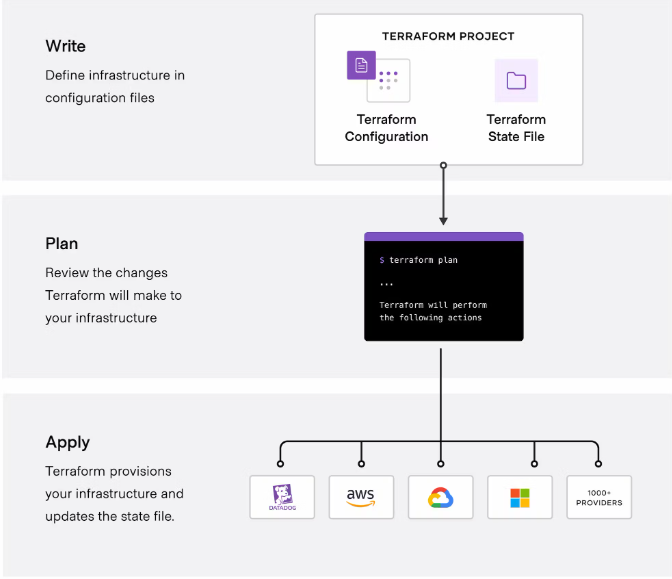

# :hammer_and_wrench: Terraform

Terraform é uma ferramenta de `infrastructure as code` que permite construir, alterar e versionar infraestrutura com segurança e eficiência. Isso inclui componentes de baixo nível, como instâncias de computação, armazenamento e rede; e componentes de alto nível, como entradas DNS e recursos SaaS.

Ela é uma ferramenta multiplataforma e open source, pode ser usada para administrar sua infraestrutura independente do seu Cloud Provider, como Azure, AWS, GCP, Digital Ocean, Alibaba Cloud, Oracle Cloud, DataDog, Helm, entre outros, veja mais em https://registry.terraform.io/browse/providers.

Você pode baixar o Terraform, e encontrar toda a documentação sobre a ferramenta em https://www.terraform.io.

O fluxo de trabalho principal do Terraform consiste em três estágios:

**Write:** você define recursos, que podem estar em vários provedores e serviços de nuvem. Por exemplo, você pode criar uma configuração para implantar um aplicativo em máquinas virtuais em uma rede Virtual Private Cloud (VPC) com grupos de segurança e um balanceador de carga.

**Plan:** o Terraform cria um plano de execução que descreve a infraestrutura que irá criar, atualizar ou destruir com base na infraestrutura existente e na sua configuração.

**Apply:** Após a aprovação, o Terraform realiza as operações propostas na ordem correta, respeitando eventuais dependências de recursos. Por exemplo, se você atualizar as propriedades de uma VPC e alterar o número de máquinas virtuais nessa VPC, o Terraform recriará a VPC antes de dimensionar as máquinas virtuais.

Seguindo o fluxo do Terraform: `Write, Plan and Apply`, para fazer o deploy de uma infraestrutura, podemos criar um arquivo `main.tf`, e em seguida, executar os comando `terraform init`, para baixar as dependências de infraestrutura, e `terraform plan` e depois `terraform apply`. Podemos usar o comando `terraform show` para mostrar um Snapshot do seu ambiente.

Dentro do Terraform, podemos configurar diversos Providers, com suas instâncias de recursos, como bancos de dados, security groups e instâncias de máquinas.

Para deletar recursos, podemos remover diretamente do arquivo de configurações do Terraform e executar os comandos, ou por meio do comando `terraform destroy -target <resource-name>`.

Podemos usar o comando `terraform refresh` para detectar qualquer desvio do último estado conhecido e para atualizar o arquivo de estado

Podemos usar o comando `terraform output` para mostrar algumas informações da infraestrutura, para isso precisamos criar um recurso chamado output, e definir o valor para ser apresentado.

